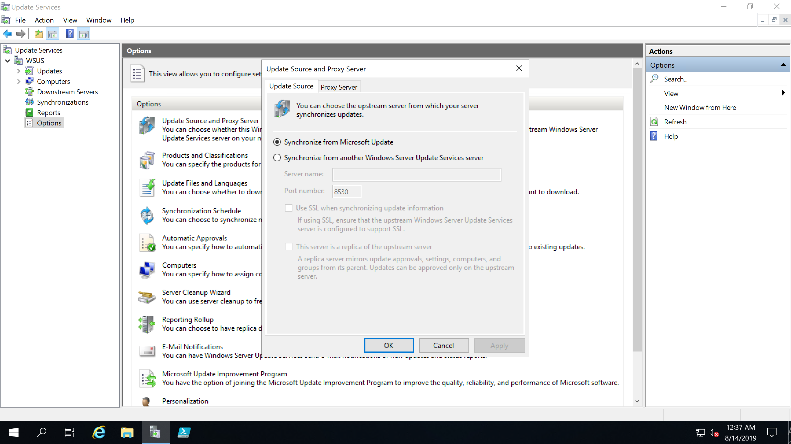
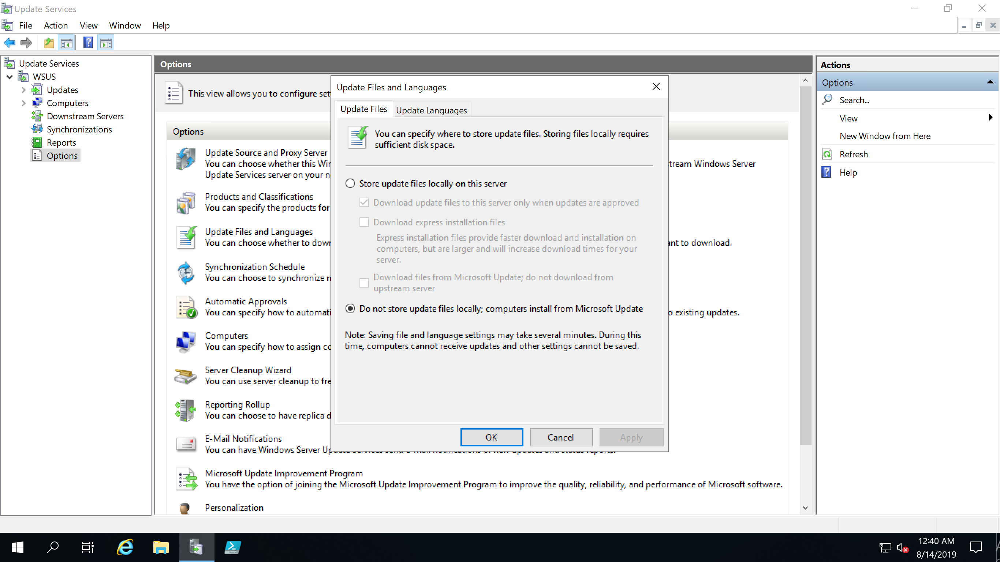
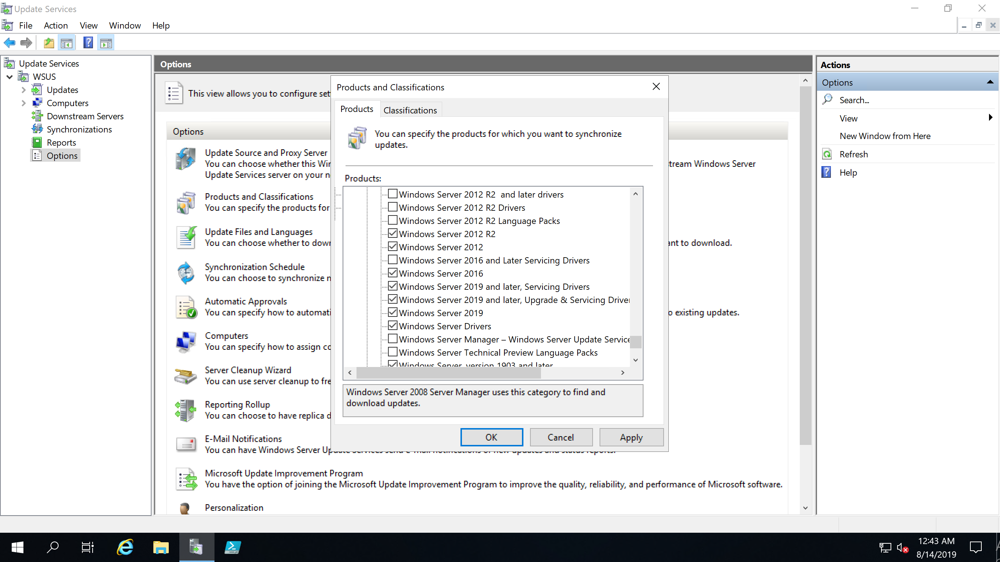
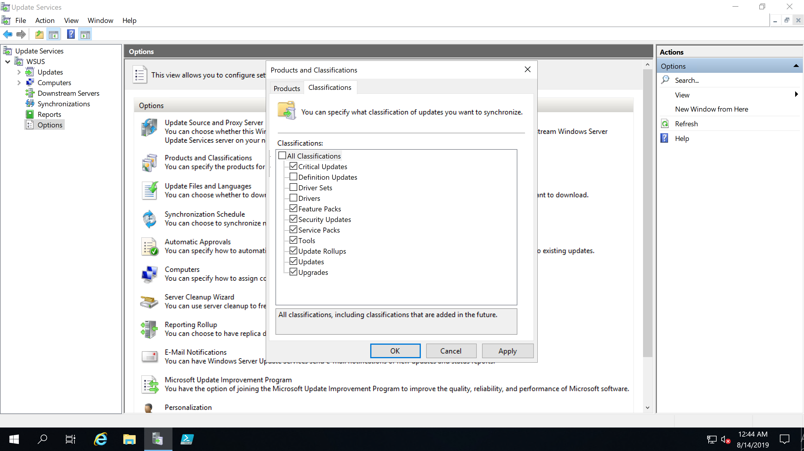

Source https://osdcatalog.osdeploy.com/docs/wsus

# WSUS Server
## Server Virtual Machine
For starters I have this running on a Virtual Machine.  WSUS is the only purpose of this Virtual Machine.  The Server Name is WSUS
## Update Source and Proxy Server
I've configured it as a standalone Server and have it set to Synchronize WSUS from Microsoft Update

## Update Files and Languages
I don't even store content on the Server, all I care about is the links

## Products and Classifications
And finally I make sure to select the proper Products

And Classifications

